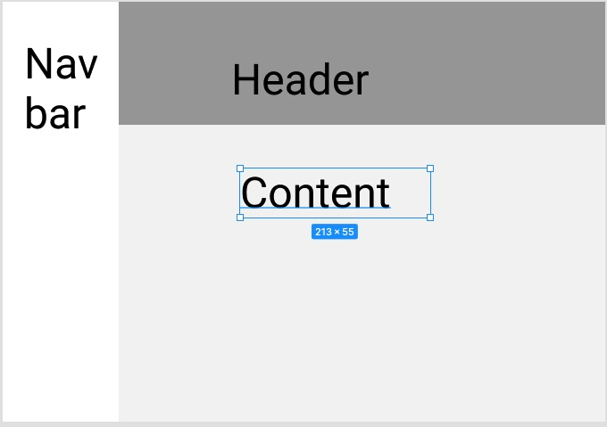

# SaasTeamFrontendTest
SAAS Team take-home frontend test

## Set up
If you have Node.js and npm/yarn installed you can simply run the `start` script (found in `package.json`) from inside the `saasfrontend` directory.

Alternatively we provide some docker-based ready-made tools to avoid having to install node on the host.

### Docker based setup (optional)
Install the following dependencies:

- [Docker](https://docs.docker.com/get-docker/) and [Docker Compose](https://docs.docker.com/compose/install/)
- [Make](https://www.gnu.org/software/make/) or a compatible GNU Make alternative

Run `make build` before you begin, to build the docker images. 

Run `make dev` to stand up the service.

If it is working, open http://localhost:3000 in the browser

## Tasks
1. Build the layout:

2. The Products payload is provided in public/products.json and is served at http://localhost:3000/products.json . This payload will have to be fetched with either `fetch` or `XMLHttpRequest`.
3. Use the products payload and build individual Nav links with `product_name`. Only `is_available` products should be displayed.
4. When a product link is clicked, the app should navigate to http://localhost:3000/products/:product_id and the product details need to be displayed. It's up to you to implement your own client-side routing solution or use an available libray.
5. The layout should be responsive.
6. The width of Navbar is `200px`, the rest of the width is header and content.
7. The Header height is `200px`, the rest of the height is taken by the content.

### Bonus points
1. Implement unit tests.

### Additional notes
1. Layout should be implemented using css without using external css libraries.
2. The color scheme can be picked as per user choice.
3. The folder structure for the code can be reorganized as per preference.
